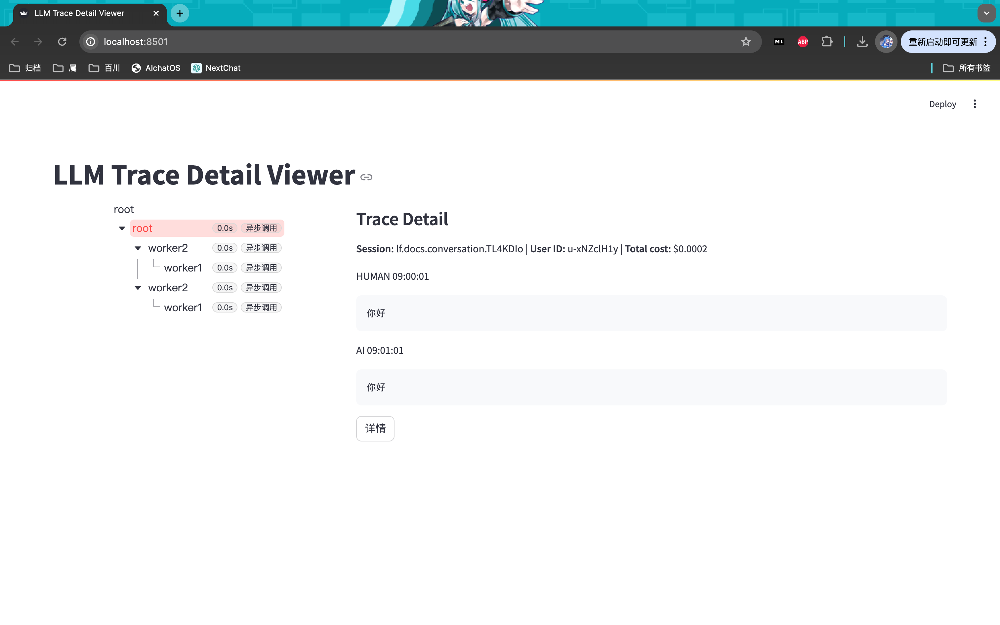

# 说明
大模型开发上线中，经常回答用户是非预期的内容，为了加快开发和上线，辅助在线环境的调试。
为llm的trace设计和实现了一套框架，帮助记录执行的各个阶段的耗时和输入输出数据，辅助调试。


# 示例

如上图
1. 左侧为总体的耗时发布
2. 右侧为对应的每一条请求的输入和输出

# 运行
当前实现了二进制和trace_viewer在同一个目录下的实现。在线环境需要上报数据到消息队列。
```
xmake build tracker
xmake run tracker
```

运行后会在二进制目录生成一个tracker.json的文件
<details>

<summary>示例内容</summary>

```
{
    "bthread_id": 0,
    "call_ts": 1718076597032,
    "dump_ts": 1718076597033,
    "scope_name": "root",
    "subroutines": [
        {
            "bthread_id": 4294969602,
            "call_ts": 1718076597032,
            "callee": "worker2",
            "callee_clazz": "7Worker2",
            "caller": "root",
            "params_in": [
                1,
                2,
                ""
            ],
            "params_out": [
                1,
                2,
                "1+2=3"
            ],
            "ret_ts": 1718076597033,
            "scope_name": "worker2",
            "subroutines": [
                {
                    "bthread_id": 4294969345,
                    "call_ts": 1718076597032,
                    "callee": "worker1",
                    "callee_clazz": "7Worker1",
                    "caller": "worker2",
                    "params_in": [
                        1,
                        2,
                        0
                    ],
                    "params_out": [
                        1,
                        2,
                        3
                    ],
                    "ret_ts": 1718076597032,
                    "scope_name": "worker1"
                }
            ]
        },
        {
            "bthread_id": 0,
            "call_ts": 1718076597033,
            "callee": "worker2",
            "callee_clazz": "7Worker2",
            "caller": "root",
            "params_in": [
                1,
                2,
                ""
            ],
            "params_out": [
                1,
                2,
                "1+2=3"
            ],
            "ret_ts": 1718076597033,
            "scope_name": "worker2",
            "subroutines": [
                {
                    "bthread_id": 4294969603,
                    "call_ts": 1718076597033,
                    "callee": "worker1",
                    "callee_clazz": "7Worker1",
                    "caller": "worker2",
                    "params_in": [
                        1,
                        2,
                        0
                    ],
                    "params_out": [
                        1,
                        2,
                        3
                    ],
                    "ret_ts": 1718076597033,
                    "scope_name": "worker1"
                }
            ]
        }
    ]
}
```
</details>

然后运行
```
mv build/linux/x86_64/debug/tracker.json .
streamlit run llm_trace_viewer.py
```
打开浏览器查看即可。

